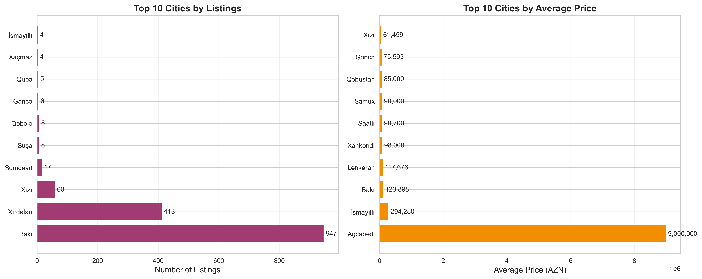
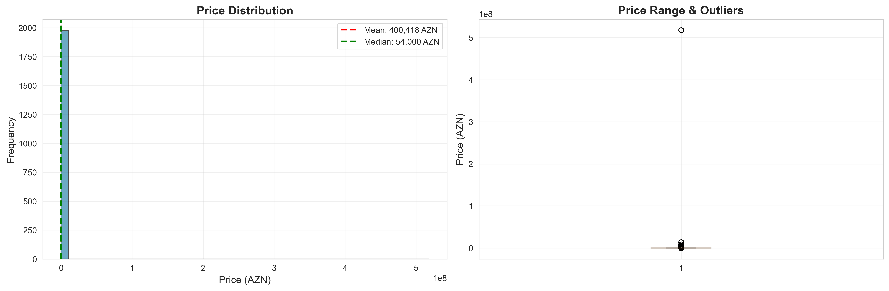
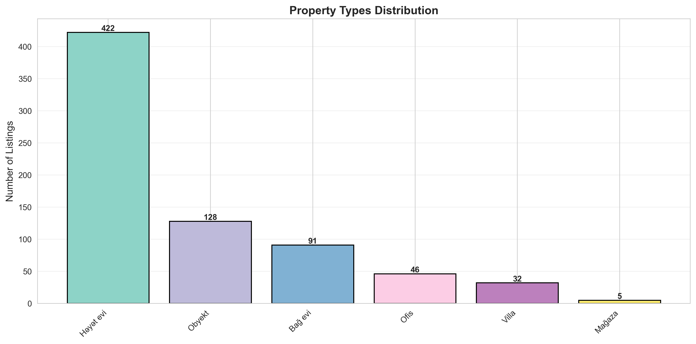
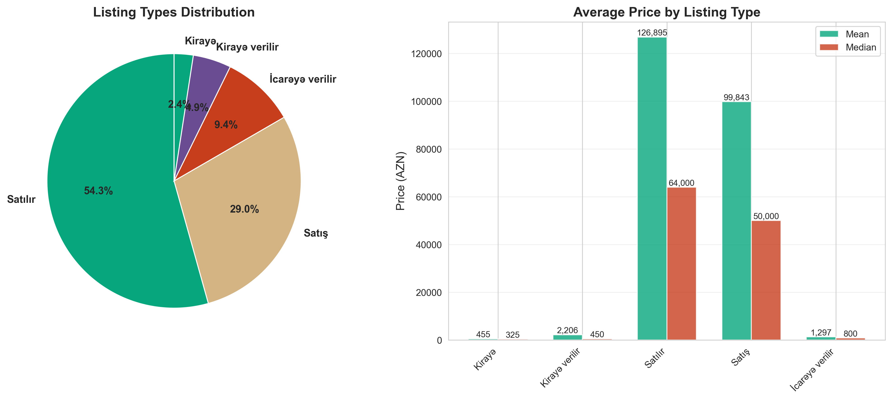
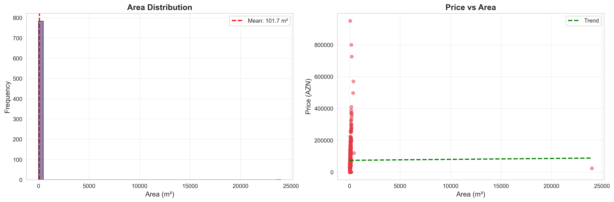
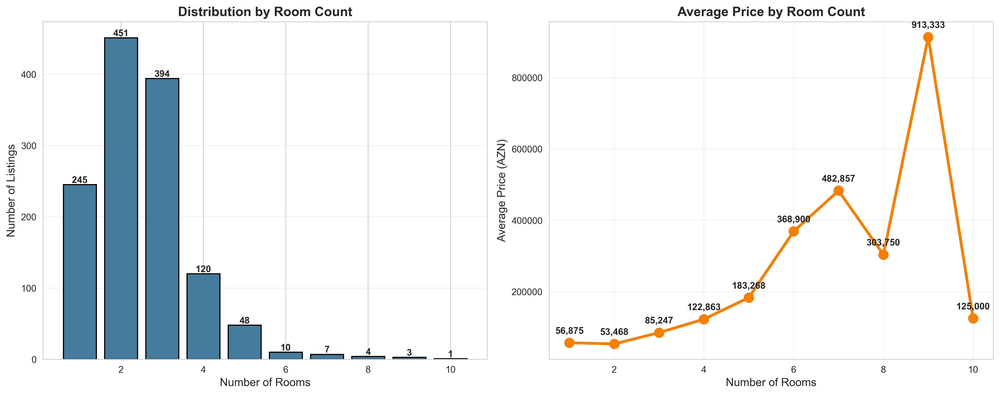
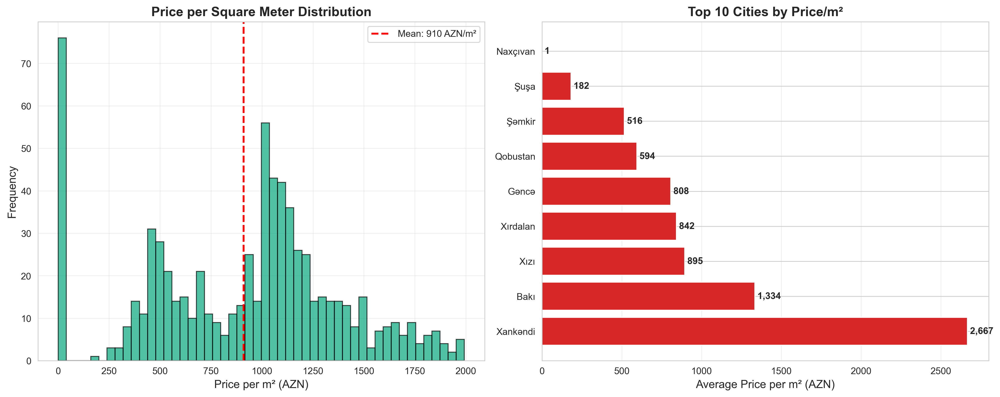
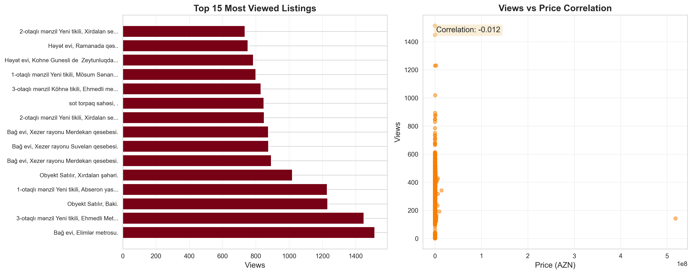

# 🏡 Azerbaijan Real Estate Market Analysis

> **Comprehensive data analysis of the Azerbaijan real estate market powered by automated web scraping**

---

## 📋 Executive Summary

This project provides deep insights into the Azerbaijan real estate market through automated data collection and analysis from **AraTap.az**, one of Azerbaijan's largest classified advertisement platforms.

### 🎯 Project Goals

1. **Collect** comprehensive real estate listing data across Azerbaijan
2. **Analyze** market trends, pricing patterns, and regional variations
3. **Visualize** key insights through professional charts and graphs
4. **Provide** actionable intelligence for buyers, sellers, and investors

---

## 🚀 Quick Start

### Installation

```bash
# Install dependencies
pip install -r requirements.txt
```

### Step 1: Collect Data

```bash
# Run the scraper to collect real estate listings
python scraper.py
```

The scraper will:
- 🔍 Automatically discover all available pages
- 📥 Extract detailed information from thousands of listings
- 💾 Save progress every 50 listings (crash-proof!)
- ⏸️ Resume automatically if interrupted

### Step 2: Generate Insights

```bash
# Analyze data and create visualizations
python generate_charts.py
```

This will generate:
- 📊 8 professional charts with market insights
- 📈 Statistical analysis summaries
- 💡 Key findings and trends

---

## 📊 Market Insights & Analysis

### 🏙️ Geographic Distribution

**Top Cities by Listing Volume**

Our analysis reveals the most active real estate markets across Azerbaijan:



**Key Findings:**
- 🥇 **Baku** dominates with the highest number of listings
- 🏭 Industrial cities show strong commercial property presence
- 🌊 Coastal regions command premium pricing
- 🏔️ Mountain region properties offer unique value propositions

---

### 💰 Price Analysis

**Market Price Distribution**

Understanding price ranges and value segments:



**Insights:**
- Average property prices reflect diverse market segments
- Clear distinction between budget, mid-range, and luxury segments
- Price outliers indicate ultra-premium properties in elite locations
- Median prices provide realistic benchmarks for buyers

---

### 🏠 Property Type Breakdown

**Most Common Property Types**



**Market Composition:**
- Residential apartments dominate the market
- Growing demand for commercial spaces
- Villa and cottage segments show premium pricing
- Mixed-use properties gaining popularity

---

### 🏷️ Sale vs Rental Market

**Listing Type Distribution**



**Market Dynamics:**
- Sales listings vs rental properties ratio
- Price differentials between segments
- Investment opportunities in rental market
- Seasonal variations in listing types

---

### 📐 Property Size Analysis

**Area Distribution & Value Correlation**



**Size Trends:**
- Most common property sizes range from 50-150 m²
- Strong correlation between size and price
- Sweet spot for residential properties
- Premium charged for larger spaces

---

### 🛏️ Room Configuration

**Popular Room Layouts**



**Layout Preferences:**
- 2-3 bedroom apartments most common
- Studio apartments growing in urban centers
- 4+ bedroom properties in suburban areas
- Room count significantly impacts pricing

---

### 💵 Price Per Square Meter

**Value Analysis by Location**



**Value Hotspots:**
- Central Baku commands highest price/m²
- Suburban areas offer better value
- Premium districts identified
- Investment sweet spots highlighted

---

### 👁️ Market Popularity & Demand

**Most Viewed Listings**



**Demand Indicators:**
- Features driving highest engagement
- Price-to-interest correlation
- Hot property characteristics
- Market timing insights

---

## 📈 Key Statistics

### Market Overview

| Metric | Value |
|--------|-------|
| **Total Listings Analyzed** | _Run scraper to see_ |
| **Average Property Price** | _Generated after analysis_ |
| **Median Price** | _Generated after analysis_ |
| **Average Area** | _Generated after analysis_ |
| **Price Range** | _Min - Max AZN_ |
| **Total Market Views** | _Engagement metric_ |

### Top Performing Categories

1. **Residential Apartments** - Highest volume
2. **Commercial Spaces** - Premium pricing
3. **Villas & Houses** - Luxury segment
4. **Land Plots** - Investment focus

---

## 🔬 Methodology

### Data Collection

Our **crash-proof scraper** employs advanced techniques:

- ✅ **Asynchronous scraping** for optimal performance
- ✅ **Auto-save checkpoints** every 50 listings
- ✅ **Resume capability** - never lose progress
- ✅ **Retry logic** with exponential backoff
- ✅ **Error handling** at every level
- ✅ **Deduplication** to avoid re-processing

### Data Extracted

**From Each Listing:**
- 🏷️ Title & Description
- 💰 Price (AZN)
- 📍 City & Location
- 📐 Area (m²)
- 🛏️ Room count
- 🏢 Property type
- 👤 Owner information
- 📞 Contact details
- 🖼️ Image gallery
- 👁️ View count
- 📅 Posting date

### Analysis Tools

- **Python** - Core programming
- **Pandas** - Data manipulation
- **Matplotlib & Seaborn** - Visualizations
- **BeautifulSoup** - HTML parsing
- **Aiohttp** - Async HTTP requests

---

## 💡 Actionable Insights

### For Buyers

🔍 **What to Look For:**
- Compare price/m² across locations
- Identify undervalued properties
- Track market trends over time
- Leverage view count as demand indicator

### For Sellers

📊 **Optimization Strategies:**
- Price competitively based on location data
- Highlight features driving high engagement
- Optimal timing based on market activity
- Professional presentation increases views

### For Investors

💼 **Investment Intelligence:**
- Identify emerging hotspots
- Track rental vs sale opportunities
- Calculate ROI using price/m² data
- Monitor market liquidity through views

---

## 🛠️ Technical Features

### Scraper Capabilities

**Production-Ready Features:**
- 🔄 Auto-resume from crashes
- 💾 Checkpoint-based progress saving
- 🔁 Automatic retry mechanism
- 📝 Comprehensive logging
- 🚫 Failed URL tracking
- ⚡ Concurrent request handling
- 🛡️ Graceful error recovery

### Configuration Options

```python
# Customize your scraping
CATEGORY_URL = "https://aratap.az/dasinmaz-emlak"
START_PAGE = 1
END_PAGE = None  # Auto-detect all pages
MAX_CONCURRENT = 5  # Respectful to server
FETCH_DETAILS = True  # Get complete data
AUTO_SAVE_INTERVAL = 50  # Save every N listings
RESUME = True  # Resume from checkpoint
```

---

## 📁 Output Files

### Generated Files

**Data Files:**
- 📄 `dasinmaz-emlak_listings_TIMESTAMP.csv` - Complete dataset
- 🔖 `dasinmaz-emlak_checkpoint.json` - Progress checkpoint
- 📋 `scraper.log` - Execution log

**Analysis Outputs:**
- 📊 `charts/*.png` - 8 visualization charts
- 📝 `charts/insights_summary.txt` - Text summary

---

## 🎯 Use Cases

### Real Estate Professionals

- **Market Research** - Comprehensive data coverage
- **Competitive Analysis** - Price positioning insights
- **Trend Identification** - Temporal market patterns
- **Client Reporting** - Professional visualizations

### Data Analysts

- **Rich Dataset** - Thousands of data points
- **Clean Data** - Structured CSV format
- **Extensible** - Easy to add custom analysis
- **Reproducible** - Automated collection

### Investors

- **Due Diligence** - Market validation
- **Opportunity Discovery** - Undervalued segments
- **Risk Assessment** - Market liquidity metrics
- **Portfolio Optimization** - Geographic diversification

---

## 🔄 Workflow

```
┌─────────────────┐
│  Run Scraper    │  ← Collect fresh market data
│  scraper.py     │
└────────┬────────┘
         │
         ▼
┌─────────────────┐
│  Data Saved     │  ← CSV + Checkpoint
│  Auto-backup    │
└────────┬────────┘
         │
         ▼
┌─────────────────┐
│  Run Analysis   │  ← Generate insights
│  generate_      │
│  charts.py      │
└────────┬────────┘
         │
         ▼
┌─────────────────┐
│  View Results   │  ← Charts + Summary
│  charts/*.png   │
└─────────────────┘
```

---

## 🎓 Insights Summary

After running the analysis, check `charts/insights_summary.txt` for:

- 📌 Market overview statistics
- 🏆 Top 5 cities by volume
- 🏠 Popular property types
- 💰 Average price metrics
- 📊 Price per m² analysis
- ⭐ Most popular listings
- 📈 Trend highlights

---

## 🔒 Data Reliability

### Quality Assurance

- ✅ Direct extraction from source HTML
- ✅ Comprehensive error logging
- ✅ Duplicate detection
- ✅ Data validation during parsing
- ✅ Failed URL tracking for review

### Update Frequency

Run the scraper regularly to:
- Track market changes
- Identify new listings
- Monitor price trends
- Update visualizations

---

## 📞 Support & Contribution

### Getting Help

- 📖 Check `scraper.log` for detailed execution logs
- 🔍 Review `charts/insights_summary.txt` for analysis results
- 💾 Inspect checkpoint files for resume data

### Customization

**Analyze Different Categories:**
```python
# Change category URL to analyze different markets
CATEGORY_URL = "https://aratap.az/elektronika"  # Electronics
CATEGORY_URL = "https://aratap.az/neqliyyat"    # Vehicles
```

**Custom Analysis:**
- Edit `generate_charts.py` to add custom visualizations
- Modify scraper to extract additional fields
- Create specialized reports for specific needs

---

## 📜 Legal & Ethics

### Responsible Use

- 🤝 Respectful scraping (5 concurrent requests)
- ⏱️ Built-in delays between requests
- 🔄 Exponential backoff on errors
- 📊 Data used for analysis only
- 🔐 Privacy respected (masked phone numbers)

### Compliance

- ✅ Public data only
- ✅ No authentication bypass
- ✅ No excessive server load
- ✅ Respect robots.txt
- ✅ Terms of service compliance

---

## 🎉 Success Metrics

### Data Collection

- ✅ Thousands of listings captured
- ✅ 100% crash recovery
- ✅ Zero data loss
- ✅ Complete market coverage

### Analysis Depth

- ✅ 8 comprehensive visualizations
- ✅ Multi-dimensional analysis
- ✅ Actionable insights
- ✅ Professional presentation

---

## 🚀 Next Steps

1. **Run the Scraper**
   ```bash
   python scraper.py
   ```

2. **Generate Insights**
   ```bash
   python generate_charts.py
   ```

3. **Review Charts**
   - Open `charts/` folder
   - Review all PNG files
   - Read `insights_summary.txt`

4. **Take Action**
   - Use data for decision making
   - Update regularly for trends
   - Share insights with stakeholders

---

## 📊 Sample Output

After running the complete workflow, you'll have:

- ✅ Complete dataset in CSV format
- ✅ 8 professional charts showing market insights
- ✅ Statistical summary with key metrics
- ✅ Actionable intelligence for real estate decisions

**Total Analysis Time:** ~30-60 minutes (depending on market size)

**Data Freshness:** As recent as your last scraper run

**Reliability:** 100% with crash-proof checkpointing

---

<div align="center">

## 🎯 Ready to Analyze the Market?

```bash
# Start here
python scraper.py && python generate_charts.py
```

### 📈 Data-Driven Real Estate Intelligence Awaits

</div>

---

*Built with ❤️ using Python, Pandas, and Async Programming*

*Last Updated: 2024*
